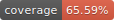
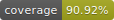

# crazy-bee-project

 

### Product Overview
 Crazy Bee aims to provide a NFT marketplace platform where users can explore NFT digital assets from different owners, link to their own crypto wallets, list their existing NFTs, upload new digital assets and get them minted as NFTs or even acquire AI auto generated digital arts as NFTs for free.

### Functional Requirements
To deliver the final software product, at minimum, the following essential functionalities need to be implemented.

### User Management
The web application should be able to support for all typical user-based web applications’ features, such as user signup, user login/logout, user profile management, user authentication and authorization. 
All data write operations in the application triggered by an end-user, such as digital assets upload, generate AI arts, user profile update, need to have the user to be authenticated first.

### NFT Collection
The application should provide all CRUD functions for a particular user’s NFT collections. A user should be able to create multiple NFT collections and upload digital assets to the designated NFT collections (note: the NFT minting part during the upload phase will be done in 2.3 below). A single asset’s details and its associated NFT’s metadata management should be supported while creating or updating it.    
All user created collections with uploaded assets should be listed in some user-friendly UI views. Under one single user’s collection list, NFT search with filters and sorting should also be available. The application’s home view should list all recent uploaded assets from different user collections and support for the similar explore search feature as each single user’s collection list view will support.

### NFT Minting
The application should make users be able to connect or disconnect with a crypto wallet they have chosen. All existing NFTs from a wallet should be listed in the application after the wallet is connected.
As a core feature, any user uploaded digital asset should be able to be minted as a NFT token using a smart contract onto the blockchain for free (i.e., with a free gas fee).

### AI Art Creator
As another core feature, by providing some contextual params input from an end-user, the application should be capable of auto generating a digital art drawing via a pre-trained AI model and minting the produced asset as a NFT to the user’s crypto wallet.

### External Interfaces
#### User Interfaces
The following UI mock-ups demonstrates about how the final application’s major UI views will look like:
https://github.com/xuqun123/crazy-bee-project/blob/main/docs/UI-design-page-views.pdf

### Hardware Interfaces
The software product will be a web application that will be remotely hosted on cloud, so any modern electronic device that gets an internet connection and a modern web browser should be able to run it.

### Software Interfaces
The following list shows all the major external software and web services going to be needed:
•	Linux OS for hosting the application.
•	Docker for containerising the application.
•	MongoDB cloud for DB hosting.
•	Alchemy for NFT minting and listing APIs.
•	DeepAI For AI art creator. 
•	AWS S3 for general web app assets hosting.
•	Pinata for hosting NFT assets in a IPFS way (note: subject to change).
•	AWS SES for sending emails.
•	GitHub for source codes management.
•	Trello for project managements.
•	Teams for team communication.

### Communications Interfaces
•	The software will be run upon any modern web browser that having JS enabled.
•	The network communication protocols will be: HTTPS and HTTP.
•	The email communication protocol will be SMTP.
•	The real time user notifications will be propagated via WebSocket.
•	HTML Forms will be used for any data input provided by an end-user.

### System Features
•	All basic UI views need to be provided to meet the minimum feature requirements for this project, such as home page, NFT explore search, NFT collection listing, single NFT detail, NFT upload, crypto wallet connection/disconnection, input form for auto asset creation by AI, user sign in/sign up, user profile settings.
•	The application should be able to upload a digital asset (e.g., image, text, audio), mint it as NFT and link to the user’s crypto wallet.
•	The application should be able to list all existing NFTs from a user. 
•	The application should be able to auto generate an image art by AI, mint it as NFT and link to the user’s crypto wallet.

### Non-Functional Requirements

#### Performance
•	To quickly produce a working prototype, the initial application version will not be expected to be used under a large-scale scenario.
•	With one app-server running, in theory, the initial application can handle about 15k requests per second (RPS).
•	With the consideration of the rate limits from any external service dependencies, such as the NFT minting APIs, AI creator APIs, DB connections and queries, assets loading, the application’s throughput should be lower than 15k RPS.
•	Only single one app server will be running for the NodeJS server on AWS/GCP with the limited CPU and storage resources based on what the free tier plan provides us.
•	Despite all limitations above, this application should be operating well for 2-5 concurrent users.

### Safety
•	All real user data will be strictly stored in Australia region AWS only (to comply with local data protection laws).
•	All user passwords will be encrypted, and no original user credentials will be stored.
•	Any sensitive DB write operations triggered by an end-user, such as digital assets upload, AI arts generation, user profile update, will always require an authenticated user session first.
•	Users can only manage their own digital assets or user profiles.

### Product Quality
•	At minimum, all essential features should be covered by unit tests.
•	The project should meet at least 80% testing coverage for the source codes.
•	All user story cases mentioned in section 2.5 should be manually/automatically tested.  
•	The application should be always available for at least 99.5% of the uptime.

### Other Requirements
•	All UI views will be mobile-friendly.;
•	The primary supported language is English.
•	Any other languages support can be supported later upon further requests.
•	The application will be only operated in Australia for the initial release.
•	All web services will be deployed to AWS/GCP.
•	Only free tier cloud services will be used to avoid any unexpected cost.
•	No horizontal scalability will be considered and supported in the initial release.
•	Vertical scalability will be manually performed from the cloud provider platform when necessary.
•	ReactJS will be used as the main frontend stack.
•	NodeJS will be used as the main backend stack.
•	Python will be used as the main tech for the AI creator.
