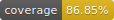

# Crazy Bee Backend

## Prerequisite

1. Please ensure `Nodejs`(>= v18.0.0) and `npm`(>=.0.0) have been installed.

2. Please make sure you have a MongoDB server with credentials ready for use.

3. VSCode is the recommended IDE for this project.

## How to Install

1. Create a new `.env` file in the root path, and copy `.env.example` values to the file.

2. Assign correct ENV variables to the `.env` file.

3. Run `npm install` to install all needed packages.

4. If all packages are installed and VSCode is configured properly, when you change any code in VSCode and save now, it should auto format to match the pre-defined code formatting rules.

## How to Run the Web Server

1. `npm start` to start the server.

2. The service is ready at http://localhost:3000/ now.

3. You can now test out a sample GET API at: http://localhost:3000/api/nftCollections.

## How to Seed Fake Data

- To feed `NFT collections` data, run the following: `npm run seed-nft-collections-data`

## How to Run Unit Tests

- To run all unit tests at once: `npm test`
- To run a single unit test file: `npm run test TEST_FILE_RELATIVE_PATH_HERE` (e.g., `npm run test tests/routes/nftCollectionRoutes.test.js`)

## How to Check Testing Coverage

- `npm run test-with-coverage` to run all tests and generate a new coverage report.
- open `coverage/lcov-report/index.html` in a browser to see the code coverage in details.

## Available APIs

1. `GET /api/nftCollections` to retrieve all NFT collections.
2. `GET /api/nftCollections/:id` to retrieve single one NFT collection.
3. `POST /api/nftCollections` with `{ "nftCollection": {"name": "name here", "summary": "summary here", "status": "published"}` payload to create a new NFT collection.
4. `PATCH /api/nftCollections/:id` with `{ "nftCollection": {"name": "name here", "summary": "summary here", "status": "published"}` payload to update an existing NFT collection.
5. `DELETE /api/nftCollections/:id` to delete an existing NFT collection.
